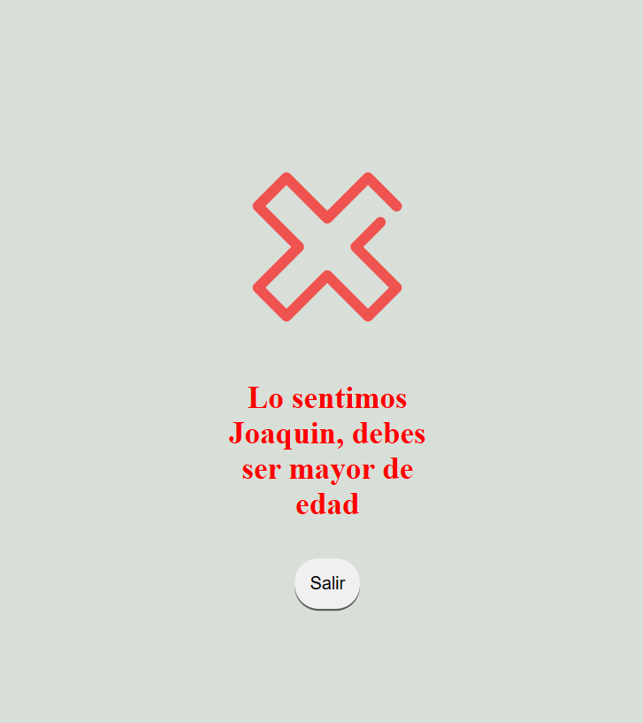

# JAVASCRIPT ESENCIAL - MODULO 1 UNIDAD 2

Este proyecto corresponde a la **Unidad 2 del Módulo 1** de la Diplomatura Full Stack.  
Se trata de una pagina interactiva realizada con **JS, HTML y CSS**, donde se realiza un formulario cumpliendo las **consignas indicadas**
El proyecto hace uso de la **manipulacion del DOM** con javascript, permitiendo dar interactividad a la pagina.

---

## Como ver el proyecto

1. Clonar el repositorio
2. Abrir el archivo Index.html en un navegador web

---

## Autor

Nombre: Joaquín Damián Delgado

Curso: Diplomatura Full Stack

Unidad: Módulo 1 – Unidad 2

Fecha: Septiembre 2025

---

## Captura

---

## Bibliografia

-Campus UTN-Learning – Unidad 2 “Javascript esencial”

-Imagen utilizada en la sección “Motivación”: image.png → extraída de internet
